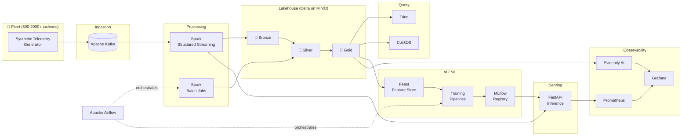

# 🚀 Industrial IoT — Data & AI Platform

> A production-grade, fully on-premise **Data + AI Platform** for predictive maintenance of an industrial machine fleet (500–2000 devices). Built end-to-end with open-source tooling and Docker Compose — streaming ingestion, a lakehouse, a feature store, ML/MLOps, real-time inference, and full observability.

<p align="left">
  
  
  
  
  
  
  
</p>

---

## 🎯 What this project demonstrates

This repository is a **capstone portfolio project** showcasing the skills of a **Data + AI Platform Engineer**. It mirrors real-world architecture patterns used at companies like Uber, Tesla, and Databricks, and is built to be run locally with zero cloud dependencies.

| Capability | Technology |
|---|---|
| Stream ingestion | Apache Kafka |
| Stream + batch processing | Apache Spark (Structured Streaming) |
| Lakehouse storage | Delta Lake on MinIO (S3) |
| SQL query engine | Trino + DuckDB |
| Orchestration | Apache Airflow |
| Feature store | Feast |
| ML / modeling | scikit-learn, XGBoost, PyTorch |
| Experiment tracking & registry | MLflow |
| Model serving | FastAPI |
| Monitoring & drift | Prometheus, Grafana, Evidently AI |
| Metadata catalog | PostgreSQL, OpenMetadata |

---

## 🧠 ML / AI use cases

1. **Predictive Maintenance** — predict machine failure within the next N hours (classification / survival analysis).
2. **Anomaly Detection** — unsupervised detection of abnormal sensor behaviour (Isolation Forest / Autoencoders).
3. **Battery Health Prediction** — regression for battery degradation estimation.
4. **Fleet Optimization** — behavioural clustering of machines.
5. **Root Cause Analysis** — link sensor patterns to failures.
6. **Real-time Alerting** — streaming anomaly detection on the Kafka feed.

---

## 🏗️ High-level architecture



A standalone diagram and SLA targets live in [docs/architecture/architecture.md](docs/architecture/architecture.md).

---

## 📂 Repository structure

```
.
├── data-generator/        # Phase 2 — synthetic telemetry + failure simulation
├── streaming/             # Phase 3 — Kafka producers & Spark streaming jobs
├── lakehouse/             # Phase 4 — bronze/silver/gold Delta jobs
├── feature-engineering/   # Phase 5 — Feast feature definitions
├── ml/                    # Phase 6-7 — training pipelines & MLOps
├── serving/               # Phase 9 — FastAPI inference service
├── orchestration/         # Airflow DAGs
├── monitoring/            # Phase 10 — Prometheus / Grafana / Evidently
├── infra/                 # Dockerfiles & service configs
├── docs/                  # System design, architecture, implementation plan
├── notebooks/             # Exploration & analysis
└── docker-compose.yml     # One-command local platform
```

---

## ⚡ Quick start

```bash
# 1. Clone
git clone https://github.com/<your-username>/industrial-iot-ai-platform.git
cd industrial-iot-ai-platform

# 2. Create & activate a virtual environment
python -m venv .venv
# Windows (PowerShell):
.\.venv\Scripts\Activate.ps1
# macOS / Linux:
# source .venv/bin/activate

# 3. Install dependencies
pip install -r requirements.txt

# 4. Configure environment
cp .env.example .env

# 5. Bring up the platform
docker compose up -d

# 6. Generate telemetry
python -m data_generator.main --machines 500 --rate 5

# 7. Explore the UIs
#   Kafka UI    → http://localhost:8080
#   MinIO       → http://localhost:9001
#   Airflow     → http://localhost:8081
#   MLflow      → http://localhost:5000
#   Grafana     → http://localhost:3000
#   FastAPI docs→ http://localhost:8000/docs
```

> Full per-phase setup instructions are in [docs/IMPLEMENTATION_PLAN.md](docs/IMPLEMENTATION_PLAN.md).
> Functional/business acceptance tests per phase are in [docs/TEST_CASES.md](docs/TEST_CASES.md).

---

## 🗺️ Build phases

| Phase | Focus | Status |
|---|---|:--:|
| 1 | System design & SLAs | � Done |
| 2 | Synthetic data generation | 🟢 Done |
| 3 | Streaming pipeline (Kafka → Spark) | ⚪ Planned |
| 4 | Lakehouse (medallion) | ⚪ Planned |
| 5 | Feature engineering (Feast) | ⚪ Planned |
| 6 | ML model building | ⚪ Planned |
| 7 | MLOps pipeline | ⚪ Planned |
| 8 | Real-time AI | ⚪ Planned |
| 9 | Model serving | ⚪ Planned |
| 10 | Monitoring & drift | ⚪ Planned |
| 11 | System design interview prep | ⚪ Planned |
| 12 | Production incident simulations | ⚪ Planned |

---

## 🧰 Tech skills highlighted

`Distributed Systems` · `Stream Processing` · `Lakehouse Architecture` · `MLOps` ·
`Feature Engineering` · `Model Serving` · `Observability` · `Docker` · `Data Modeling`

---

## 📜 License

Released under the [MIT License](LICENSE).
