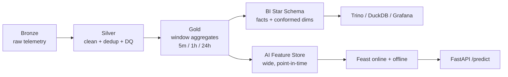
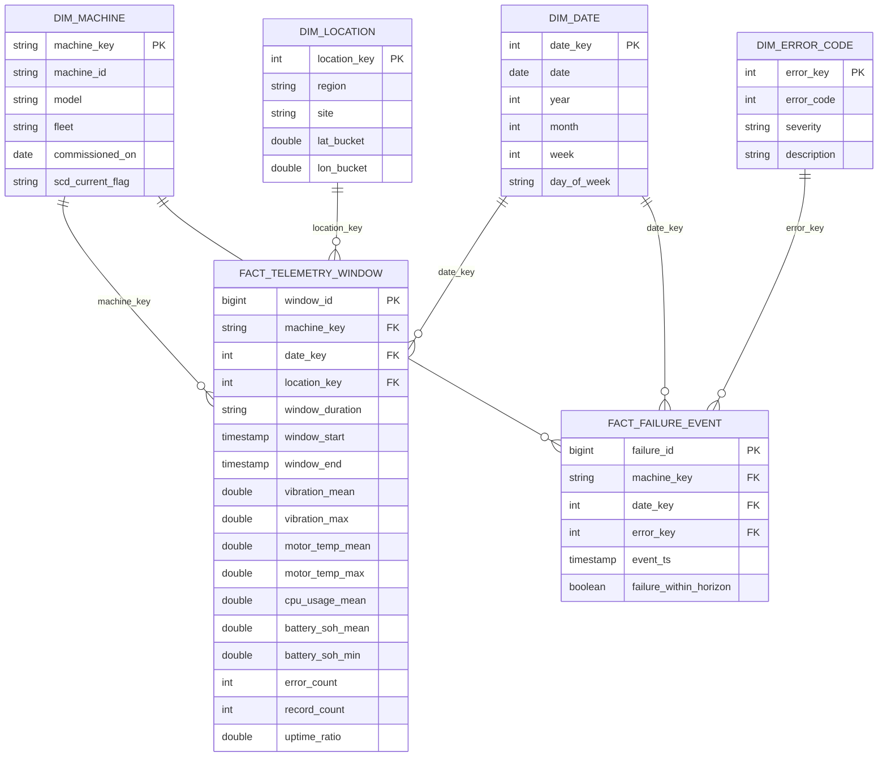
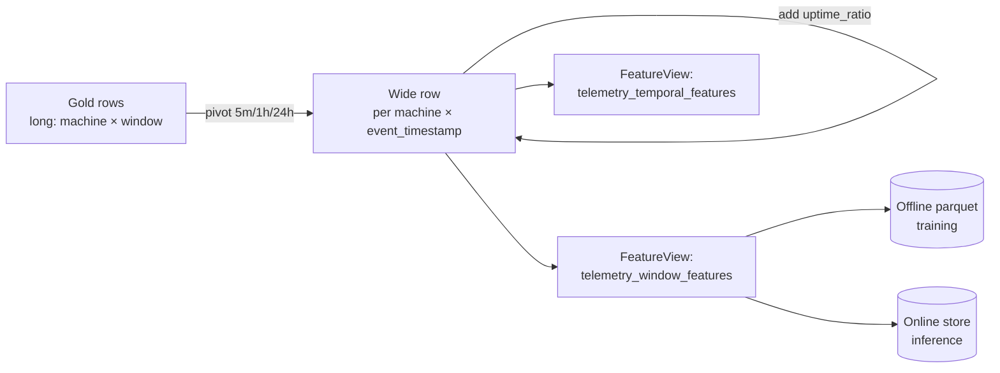

# Data Modeling — BI & AI

> Design rationale for the analytical (BI) and machine-learning (AI) data models of the
> Industrial IoT Data & AI Platform. Grounded in the implemented medallion lakehouse
> (Bronze → Silver → Gold) and the Feast feature store.
>
> Companion docs: [architecture.md](architecture/architecture.md) ·
> [IMPLEMENTATION_PLAN.md](IMPLEMENTATION_PLAN.md) · [SOURCE_ANALYSIS.md](SOURCE_ANALYSIS.md)

---

## 0. Why two models from one source

The platform ingests **one** physical event stream — a `TelemetryRecord` emitted per
machine at ~5 Hz — but two very different consumers read from it:

| Consumer | Question it answers | Access pattern | Latency | Grain it wants |
|---|---|---|---|---|
| **BI / Analytics** | "What happened, where, and how is the fleet trending?" | Wide scans, group-by, slice-and-dice, time series | Seconds (interactive) | Aggregated, business-friendly |
| **AI / ML** | "Will *this* machine fail in the next horizon?" | Point lookups by entity+time, full-column training pulls | < 100 ms online; bulk offline | Per-entity feature vector, leak-free |

A single shared table cannot serve both well: BI wants conformed dimensions and
pre-aggregated facts for fast group-bys; ML wants a denormalized, point-in-time-correct
feature matrix keyed by `(entity, event_timestamp)`. So we model the **same Gold layer
two ways** — a **dimensional (star) model for BI** and a **feature/entity model for AI** —
both derived from the same conformed Gold aggregates. This is the standard "one lakehouse,
two serving shapes" pattern.

---

## 1. The shared foundation: the medallion lakehouse

Before the BI and AI shapes diverge, the data passes through three conformed layers.
This is itself a modeling decision — **medallion over a monolithic schema** — and it is
the substrate both downstream models depend on.

### 1.1 Layer-by-layer grain

| Layer | Grain | Key | Partitioning | Mutability | Purpose |
|---|---|---|---|---|---|
| **Bronze** | 1 raw reading | `(machine_id, ts)` + Kafka offset | `event_date` | append-only, immutable | Replayable system of record |
| **Silver** | 1 clean reading | `(machine_id, ts)` | `event_date` | MERGE (idempotent) | Deduplicated, DQ-validated, type-safe |
| **Gold** | 1 machine × window | `(machine_id, window_end, window_duration)` | `event_date` + `window_duration` | overwrite (recompute) | Conformed aggregates + labels |

- **Bronze** keeps Kafka lineage (`_topic`, `_partition`, `_offset`, `_kafka_ts`,
  `_ingest_ts`) so the pipeline is replayable and exactly-once auditable.
- **Silver** dedups on `(machine_id, ts)` (latest `_ingest_ts` wins), routes
  DQ-violating rows to a quarantine table, and drops Kafka metadata.
- **Gold** computes rolling statistics per machine at **three granularities** (5m / 1h /
  24h) and attaches the predictive-maintenance label `failure_label`.

### 1.2 Why medallion (and why not the alternatives)

| Alternative | Why rejected here |
|---|---|
| **Single "clean" table** (no layers) | No replay boundary; a bad transform corrupts the only copy. No place to quarantine malformed rows. Can't reprocess history without re-ingesting from Kafka. |
| **Lambda architecture** (separate batch + speed code paths) | Two code bases computing the same metrics → drift and double maintenance. The medallion + Structured Streaming gives near-real-time Bronze *and* batch Gold from one codebase. |
| **Warehouse-first (ELT into Snowflake-style RDBMS)** | The raw signal is high-volume semi-structured telemetry (~10k msg/s). Landing it raw in Delta on object storage (MinIO) is cheaper, schema-flexible, and replayable; the warehouse shape is derived *after* cleansing. |

**Why medallion is selected:** clear contracts between layers, an immutable replay point
(Bronze), an idempotent quality gate (Silver), and a single conformed aggregate layer
(Gold) that both BI and AI fan out from — minimizing metric drift because both consumers
share the same upstream definitions.

---

## 2. BI / Analytics data model — Dimensional (Star Schema)

### 2.1 Real-world scenario

A **fleet operations manager** opens a Grafana / Trino-backed dashboard and asks:

- "Show daily average vibration and motor temperature **by machine model and region**
  for the last 30 days."
- "Which **error codes** spiked this week, and on which **machines**?"
- "What is fleet **uptime %** and **failure rate** trended month-over-month?"
- "Drill from region → site → individual machine to find the worst performers."

These are **slice-and-dice, roll-up, and drill-down** queries over business dimensions —
the textbook use case for a **dimensional (Kimball star) model**.

### 2.2 The model

A star schema centers **fact tables** (numeric, additive measures at a defined grain)
surrounded by **conformed dimension tables** (the descriptive "by what" axes).

**Fact tables**

| Fact | Grain | Source | Measures |
|---|---|---|---|
| `fact_telemetry_window` | 1 machine × window (5m/1h/24h) | Gold table directly | vibration/motor_temp/cpu/battery aggregates, `error_count`, `record_count`, `uptime_ratio` |
| `fact_failure_event` | 1 failure flag occurrence | Silver/Gold label | `failure_within_horizon`, count of error events |

**Conformed dimensions:** `dim_machine` (SCD Type 2 for model/fleet reassignment),
`dim_date` (standard calendar), `dim_location` (region/site rollup from GPS), and
`dim_error_code` (decode `error_code` → severity/description).

`fact_telemetry_window` is essentially the **Gold table re-keyed with surrogate
dimension keys** — the heavy aggregation is already done in Gold, so the BI layer is a
thin, fast, join-friendly projection.

### 2.3 Why a star schema is selected

- **Query performance & simplicity:** BI queries are predominantly `GROUP BY dimension`
  over additive measures. Star schemas minimize the number of joins (one hop fact →
  dimension) and let engines (Trino/DuckDB) use star-join optimizations and partition
  pruning on `event_date`.
- **Business intelligibility:** Dimensions map directly to how the business reasons —
  *by machine, by region, by date, by error type*. Self-service BI users build
  drill-downs without understanding the telemetry internals.
- **Conformed dimensions = consistent KPIs:** `dim_machine` and `dim_date` are shared
  across all facts, so "failure rate by region" and "avg vibration by region" line up on
  identical axes. No metric drift between reports.
- **Additivity:** Measures (`error_count`, `record_count`) are additive across all
  dimensions; semi-additive ones (`battery_soh_mean`) are handled with explicit averaging
  rules. This makes roll-ups trustworthy.
- **Slowly Changing Dimensions:** SCD Type 2 on `dim_machine` preserves history — if a
  machine is re-assigned to a new fleet, past facts still attribute to the fleet it had at
  the time.

### 2.4 Why other models are NOT used for BI

| Candidate model | Why not for BI here |
|---|---|
| **3NF / Inmon normalized warehouse** | Optimized to remove redundancy for OLTP-style integrity, but forces many joins for analytical roll-ups → slow, and unintuitive for dashboard authors. We don't need transactional update integrity on aggregates. |
| **One Big Table (fully denormalized wide table)** | Great for ML, but for BI it bloats storage (dimension attributes repeated on every row), makes conformed-dimension changes (e.g., re-decoding an error code) expensive, and loses clean drill paths/SCD history. |
| **Snowflake schema (normalized dimensions)** | Adds extra dimension-to-subdimension joins for marginal storage savings. With small dimensions (a few thousand machines), the storage win is negligible and the extra joins hurt interactive latency. Star is flatter and faster. |
| **Data Vault** | Excellent for auditable, multi-source, long-horizon enterprise integration, but it is **write/integration-optimized**, not query-optimized. Analysts can't query hubs/links/satellites directly; you'd still build star marts on top. Overkill for a single-source telemetry platform. |
| **Cube / pre-materialized OLAP cube** | Rigid; every new dimension or measure requires a rebuild. Trino/DuckDB over a star on Delta gives cube-like performance with full SQL flexibility and no separate cube engine to operate. |

### 2.5 Benefits summary (BI)

- Sub-second interactive drill-downs via partition pruning + single-hop joins.
- Business-conformed, self-service-friendly semantics.
- Consistent KPIs across all reports (conformed dimensions).
- Historical accuracy via SCD Type 2.
- Thin transform from Gold → low maintenance, low metric-drift risk.

---

## 3. AI / ML data model — Feature Store (wide, point-in-time entity model)

### 3.1 Real-world scenario

A **predictive-maintenance model** must answer, for a given machine **at a given moment**:
"Will this machine fail within the lead-time horizon?" Two access patterns exist:

- **Training (offline):** pull a leak-free historical feature matrix for thousands of
  `(machine_id, event_timestamp)` rows to fit/validate the model.
- **Inference (online):** at scoring time, fetch the **latest** feature vector for one
  `machine_id` in **< 100 ms** and call the model via FastAPI.

Both demand a model shape that is **denormalized, entity-keyed, time-versioned, and
point-in-time correct** — i.e. a **feature store**, implemented here with **Feast** over
the Gold-derived wide feature table.

### 3.2 The model

The transform `build_feature_dataset` pivots the three Gold windows into **one wide row
per `(machine_id, event_timestamp)`**, where `event_timestamp = window_end` of the 5m
anchor window:

**Entity:** `machine` (`join_keys=["machine_id"]`).

**Feature views** (as implemented):

| FeatureView | TTL | Representative features |
|---|---|---|
| `telemetry_window_features` | 1 day | `vibration_mean_5m/1h/24h`, `motor_temp_mean_5m/1h/24h`, `cpu_usage_mean_*`, `battery_soh_mean_*`, `error_count_5m`, `record_count_5m`, label `label_failure_within_horizon` |
| `telemetry_temporal_features` | 30 min | `*_lag_1`, `*_lag_3`, `*_roc_1` (rate of change), `uptime_ratio_5m` |

Two time semantics columns make the model correct:
- **`event_timestamp`** — when the feature became *true in the world* (event time).
- **`created_timestamp`** — when the row was *computed* (processing time), used to break ties.

### 3.3 Why a point-in-time feature model is selected

- **No data leakage (the cardinal ML rule):** training must only use information that was
  available **at or before** each label's timestamp. `point_in_time_join` /
  `get_historical_features` use an as-of (`merge_asof`, `direction="backward"`) join so
  each training row gets the **latest feature ≤ event_timestamp** — never a future value.
  A star schema's plain joins would happily pull "current" dimension values into a past
  fact and leak the future.
- **Train/serve consistency:** the **same** feature definitions populate the offline
  (training) and online (serving) stores, eliminating training-serving skew — a leading
  cause of silent model degradation.
- **Low-latency point lookups:** inference needs one entity's vector *now*. A wide row
  keyed by `machine_id` is an O(1) online lookup; an analytical star would require
  runtime joins/aggregations, blowing the < 100 ms p95 budget.
- **Denormalized = model-ready:** estimators consume a flat numeric vector. Pre-joining
  all windows/lags/ROC into one row means no join logic in the hot path.
- **Time-travel via TTL:** Feast TTLs (`window`=1d, `temporal`=30m) bound feature
  freshness so stale signals aren't silently served.

### 3.4 Why other models are NOT used for AI

| Candidate model | Why not for ML here |
|---|---|
| **Star / dimensional schema** | Joins resolve to *current* dimension state → **leakage** and train/serve skew. Multi-join group-bys are too slow for < 100 ms online scoring. Dimensions aren't features; models want flat numeric vectors. |
| **Normalized (3NF) tables** | Forces the model pipeline to re-join + re-aggregate on every train and every prediction → slow, error-prone, and a fresh chance to introduce leakage each time. |
| **Raw Silver/event-level table fed directly to the model** | No aggregation/windowing, so the model sees noisy 5 Hz points without trend context; recomputing rolling stats at inference time is expensive and inconsistent with training. |
| **Ad-hoc per-notebook feature CSVs** | No single source of truth, no point-in-time guarantee, no online store, no reuse across models → skew, duplicated logic, and unreproducible training sets. The feature store exists precisely to kill this anti-pattern. |
| **OLAP cube** | Pre-aggregated along fixed dimensions; can't deliver arbitrary per-entity lag/ROC feature vectors or guarantee as-of correctness. |

### 3.5 Benefits summary (AI)

- Leak-free training via point-in-time (as-of) joins.
- Zero train/serve skew — one feature definition, two stores.
- < 100 ms online lookups by entity key.
- Reusable, versioned features shared across models (predictive maintenance, anomaly,
  battery health).
- Freshness governed by per-view TTLs.

---

## 4. Side-by-side: why the same data needs two shapes

| Dimension | BI Star Schema | AI Feature Store |
|---|---|---|
| **Primary question** | "What happened / trend?" (descriptive) | "What will happen to this entity?" (predictive) |
| **Grain** | machine × window, surrogate-keyed | machine × event_timestamp, wide vector |
| **Shape** | normalized-ish (facts + dims) | fully denormalized wide row |
| **Join at read** | fact → dimension (1 hop) | none (pre-joined) |
| **Time semantics** | calendar dimension, current dim state | event_time + created_time, as-of correct |
| **Latency** | interactive seconds | < 100 ms online |
| **Consumers** | Trino, DuckDB, Grafana, analysts | Feast → FastAPI → models |
| **Cardinal rule** | conformed dimensions / additivity | no leakage / no train-serve skew |
| **History** | SCD Type 2 | point-in-time + TTL |

**Both derive from the same Gold layer**, so the underlying numbers (e.g. average
vibration in a window) are defined **once** and stay consistent between a manager's
dashboard and the model's training set.

---

## 5. Design decisions log (traceable to the codebase)

| Decision | Where it lives | Rationale |
|---|---|---|
| Partition Kafka + Delta by `machine_id` / `event_date` | Bronze/Silver/Gold writers | Even parallelism + date pruning for time-range queries |
| Event time (`ts` / `window_end`) over ingestion time | `parse_and_enrich`, Gold `window` | Correct windows and leak-free features under late/out-of-order data |
| Three window granularities (5m/1h/24h) | `WINDOW_SPECS` | Short windows = reactivity; long windows = trend/seasonality for both KPIs and features |
| Label = `max(failure_within_horizon)` per window | `_compute_one_window` | Window is "failing" if any reading inside it is → conservative supervised target |
| `event_timestamp = window_end` | `pivot_gold_to_wide` | Guarantees features describe only the *completed* window (no peeking) |
| Wide pivot + lag/ROC/uptime | `build_feature_dataset` | Model-ready vector; temporal dynamics captured explicitly |
| Quarantine instead of drop | Bronze + Silver writers | Bad data is auditable, never silently lost — protects both BI accuracy and ML integrity |

---

## 6. Glossary

- **Conformed dimension** — a dimension (e.g. `dim_date`, `dim_machine`) shared identically
  across multiple facts so metrics align across reports.
- **Additive / semi-additive measure** — a measure summable across all dimensions
  (`error_count`) vs only some (`battery_soh_mean`, which is averaged not summed over time).
- **SCD Type 2** — slowly changing dimension that versions rows to preserve history.
- **Point-in-time correctness** — guaranteeing each training row uses only features known
  at or before its label timestamp (as-of join).
- **Train/serve skew** — divergence between features used in training vs serving; the
  feature store eliminates it by sharing definitions.
- **TTL** — time-to-live bounding how long a feature value is considered fresh for serving.
