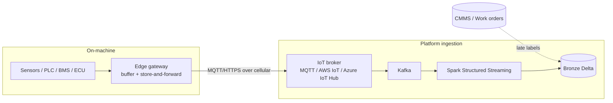

# Source Analysis — Synthetic IoT Telemetry vs. Real-World Sources

> Companion to [architecture.md](architecture/architecture.md) and
> [IMPLEMENTATION_PLAN.md](IMPLEMENTATION_PLAN.md). This document explains **what data the
> platform consumes**, how the synthetic generator (Phase 2) maps to a real industrial
> fleet, where it is **faithful** to reality, where it **deliberately simplifies**, and how
> the equivalent ingestion would happen in production.

---

## 1. Purpose & scope

The platform is built and demonstrated on **synthetic telemetry** produced by the
[`data-generator`](../data-generator/) package instead of physical machines. This is a
deliberate engineering choice: it lets us exercise the full Data + AI stack (Kafka → Spark →
Delta lakehouse → Feast → MLflow → FastAPI) with reproducible, labelled, controllable data,
without access to a real OEM fleet.

This document is the bridge between that synthetic source and the real world, so that every
downstream design decision (partitioning, windowing, drift detection, model labels) can be
traced back to a realistic source assumption.

---

## 2. What data do we have?

### 2.1 The contract: `TelemetryRecord`

Every machine emits one [`TelemetryRecord`](../data-generator/data_generator/schema.py) per
tick. This Pydantic model is the shared schema contract across Phases 2–9.

| Field | Type | Unit / range | Meaning | Real-world sensor analogue |
|---|---|---|---|---|
| `machine_id` | str | `machine-00001` | Stable identity; Kafka/Delta partition key | Asset / VIN / serial number |
| `ts` | datetime | UTC | **Event time** the reading was produced | Device RTC / edge clock |
| `lat`, `lon` | float | WGS84 degrees | Position | GPS / GNSS receiver |
| `speed` | float | km/h, ≥ 0 | Ground speed | Wheel encoder / GPS doppler |
| `accel_x/y/z` | float | m/s² | 3-axis acceleration (z centred on ~9.81 g) | IMU / MEMS accelerometer |
| `vibration` | float | RMS, ≥ 0 | Vibration magnitude, rises with wear | Piezo accelerometer / vibration probe |
| `battery_soh` | float | [0, 1] | Battery state of health | BMS (Battery Management System) |
| `motor_temp` | float | °C | Motor temperature | Thermocouple / RTD / PT100 |
| `cpu_usage` | float | 0–100 % | Controller CPU load | Edge controller / PLC telemetry |
| `error_code` | int | 0 = healthy | Fault category (overheat/vibration/battery) | DTC / fault register (e.g. J1939 SPN/FMI) |
| `event` | str | `ok`/`warning`/`fault` | Discrete event/log label | Event log / alarm bus |
| `failure_within_horizon` | bool | — | **Supervised label**: failure within lead-time | *Derived from maintenance records (not a sensor)* |

### 2.2 How the data is generated (so it is realistic, not random)

The generator is **stateful**, not a random draw per row — this is the key to realism:

- **Latent physics** ([`machine.py`](../data-generator/data_generator/machine.py)): each
  machine carries evolving position, heading, load, motor temperature, battery SoH and a
  hidden **wear** value. Successive readings are *temporally correlated*; sensor noise is
  added on top of the latent state.
- **Degradation model** ([`failure.py`](../data-generator/data_generator/failure.py)): a
  hidden wear process in `[0, 1]` grows over time. A configurable fraction of machines
  (`FAILURE_INJECTION_RATE`, default 2%) are seeded as *degrading*, so failures stay rare.
  When wear crosses `FAILURE_THRESHOLD`, observable signals drift: vibration rises, motor
  temperature gains a thermal bias, battery SoH decays faster, CPU spikes, and an
  `error_code` / `event` is raised.
- **Forward-looking label**: records within `FAILURE_LEAD_TIME_STEPS` *before* a failure are
  labelled `failure_within_horizon=True` — exactly the target a predictive-maintenance model
  needs to learn.
- **Reproducibility**: a fixed seed and a deterministic per-machine RNG stream
  ([`fleet.py`](../data-generator/data_generator/fleet.py)) make every run repeatable.

### 2.3 Volume & shape

| Property | Value | Source |
|---|---|---|
| Fleet size | 500–2000 machines | `FLEET_SIZE` |
| Rate | ~5 Hz per machine | `TELEMETRY_RATE_HZ` |
| Peak throughput | up to ~10k msg/s | architecture SLA |
| Partition key | `machine_id` | Kafka + Delta |
| Serialization | JSON (NDJSON for file sink) | sinks |
| Failure prevalence | ~2% of fleet degrading | `FAILURE_INJECTION_RATE` |

---

## 3. Equivalent real-world sources

In a production deployment, each synthetic signal would originate from a physical sensor or
sub-system on the machine, aggregated by an on-board **edge gateway** and shipped upstream.

| Synthetic field group | Real-world source system | Typical protocol / bus |
|---|---|---|
| `lat`, `lon`, `speed` | GNSS/GPS module | NMEA 0183, UBX |
| `accel_*`, `vibration` | IMU / vibration sensors | I²C/SPI on-board, sampled by MCU |
| `motor_temp` | Thermocouples / RTDs via PLC | Modbus, OPC-UA |
| `cpu_usage`, `event` | Edge controller / industrial PC | Node exporter, syslog |
| `battery_soh` | BMS | CAN bus |
| `error_code` | ECU / drivetrain diagnostics | **CAN / J1939** (SPN+FMI), OBD-II/UDS |
| `failure_within_horizon` (label) | **CMMS / maintenance records** | SAP PM, Maximo, work orders |

**Key real-world distinction:** the *features* come from sensors/telemetry, but the *label*
(did it actually fail?) comes from a **separate system of record** — the maintenance
management system (CMMS). In production, labels arrive **late and out-of-band** and must be
*joined* to historical telemetry by `machine_id` + time window. Our generator emits the label
inline only because it knows the ground-truth hidden state — see §5.

### 3.1 How ingestion happens in the real world

1. **Sensors → edge gateway.** Field buses (CAN, Modbus, OPC-UA) feed an on-board gateway
   that timestamps, batches, compresses, and buffers readings (store-and-forward for
   connectivity gaps).
2. **Edge → broker.** The gateway publishes over **MQTT** (or HTTPS) via cellular/Wi-Fi to a
   managed IoT broker (AWS IoT Core, Azure IoT Hub, HiveMQ, EMQX).
3. **Broker → Kafka.** A bridge/connector lands messages on Kafka topics, partitioned by
   `machine_id`, exactly as our generator's Kafka sink does.
4. **Kafka → Bronze.** Spark Structured Streaming consumes and writes raw records to the
   Bronze Delta layer with exactly-once semantics (checkpoint + idempotent writes).
5. **Labels join later.** Maintenance/work-order events from the CMMS are ingested
   separately and joined to telemetry to build training labels.

Our platform replicates **steps 3–5** faithfully. Steps 1–2 are collapsed: the generator
**is** the fleet + edge gateway, publishing JSON directly to Kafka
([`kafka_sink`](../data-generator/data_generator/sinks/kafka_sink.py)).

---

## 4. Where the synthetic data **aligns** with reality

These properties are intentionally faithful, so the pipeline design generalizes:

- **Event-time semantics.** Records carry a device-side `ts`; downstream features use event
  time, not ingestion time — matching real fleets where messages arrive out of order.
- **Partitioning by `machine_id`.** Mirrors real keyed ingestion and per-asset locality.
- **Temporal correlation.** Stateful simulation produces smooth trends, drift and regime
  changes — the signal structure that time-window/rolling features (Phase 5) exploit.
- **Rare, labelled failures with lead time.** Class imbalance (~2%) and a forward horizon
  reflect real predictive-maintenance problems and drive metric choices (AUC/F1 over
  accuracy).
- **Multi-modal signals + fault codes.** Mix of continuous sensors and discrete
  `error_code`/`event` mirrors real CAN/DTC + analog telemetry.
- **Throughput envelope.** 500–2000 machines × ~5 Hz ≈ up to 10k msg/s, sized to the
  architecture SLA, so backpressure/scaling behavior is representative.

---

## 5. Where the synthetic data **differs** (and why it matters)

| Aspect | Synthetic generator | Real world | Downstream implication |
|---|---|---|---|
| **Label availability** | `failure_within_horizon` emitted inline | Labels come late from CMMS, joined out-of-band | Real training needs a point-in-time correct label join; don't assume inline labels |
| **Data quality** | Clean, complete, well-typed | Missing values, stuck sensors, drift, duplicates, clock skew, schema drift | Silver-layer DQ/cleansing (Phase 4) is *more* critical in production |
| **Timestamps** | Monotonic edge clock, no gaps | Out-of-order, late arrivals, connectivity gaps, RTC drift | Needs watermarking + late-data handling in streaming |
| **Failure physics** | Single hidden wear scalar → threshold | Many failure modes, interacting components, non-monotonic faults | Real models need richer features and multi-class fault taxonomy |
| **Geography / motion** | Random walk in a central-Europe bounding box | Real routes, depots, geofences, terrain | Geospatial features are simplified placeholders |
| **Noise model** | Gaussian sensor noise | Heavy-tailed, bursty, correlated, biased | Anomaly detection thresholds need recalibration on real data |
| **Fleet composition** | Homogeneous machine model | Mixed makes/models/firmware/ages | Real pipelines need per-model normalization / cohorting |
| **Security / auth** | None (trusted local) | Per-device certs, TLS, token rotation, tamper | Production ingestion adds device identity & auth |
| **Backpressure / loss** | Lossless | Dropped/duplicated messages, retransmits | Exactly-once + dedup matter more in production |
| **Cardinality of events** | 3 fault categories | Hundreds of SPN/FMI codes | Fault encoding must scale |

**Bottom line:** the generator is faithful in *structure and semantics* (so the
architecture transfers), but optimistic in *data quality and failure complexity* (so the
Silver/Gold cleansing, drift monitoring, and model evaluation layers are exactly where a real
deployment would invest more).

---

## 6. Implications for the platform design

- **Phase 3 (streaming):** keep watermarking/late-data handling even though synthetic data is
  ordered — it is required the moment real edge data arrives.
- **Phase 4 (lakehouse):** Silver DQ rules (null checks, range validation, dedup) are written
  against the clean synthetic feed but designed for dirty real input.
- **Phase 5 (feature store):** use **event time** and point-in-time correct joins so the same
  feature code works when labels arrive late from a CMMS.
- **Phases 6–7 (MLOps):** evaluate with imbalance-aware metrics; the inline label is a stand-in
  for a future CMMS join.
- **Phase 10 (monitoring):** drift detection (Evidently) is validated on injected synthetic
  drift but targets real sensor/firmware drift.

---

## 7. Swapping in a real source later

Because the [`TelemetryRecord`](../data-generator/data_generator/schema.py) schema is the
contract, a real source can replace the generator with **no downstream changes** by:

1. Bridging the real IoT broker (MQTT/IoT Hub) to the existing Kafka topic
   (`iot.telemetry`), keyed by `machine_id`.
2. Mapping real sensor payloads to the `TelemetryRecord` fields (a thin transform/connector).
3. Ingesting CMMS work orders to a separate topic/table and building
   `failure_within_horizon` via a point-in-time label join instead of inline emission.
4. Strengthening Silver DQ rules for real-world messiness (missing/late/duplicate data).

Everything from Bronze onward — partitioning, streaming, features, models, serving — remains
unchanged.

---

## References
- Schema contract: [data-generator/data_generator/schema.py](../data-generator/data_generator/schema.py)
- Degradation model: [data-generator/data_generator/failure.py](../data-generator/data_generator/failure.py)
- Per-machine simulator: [data-generator/data_generator/machine.py](../data-generator/data_generator/machine.py)
- Architecture & SLAs: [architecture/architecture.md](architecture/architecture.md)
- Roadmap: [IMPLEMENTATION_PLAN.md](IMPLEMENTATION_PLAN.md)
