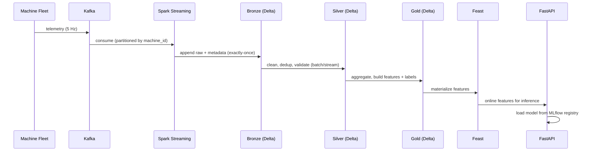

# Architecture & SLAs

> Phase 1 deliverable — system design foundation for the Industrial IoT Data & AI Platform.

## 1. Requirements

### Functional
- Ingest telemetry from 500–2000 machines at ~5 Hz/machine (up to ~10k msg/s).
- Persist raw, cleaned, and analytics-ready data in a queryable lakehouse.
- Train and serve ML models for predictive maintenance, anomaly detection, and battery health.
- Provide real-time anomaly alerting on the streaming feed.
- Expose low-latency inference via REST API.
- Monitor system health and model/data drift.

### Non-functional
| Concern | Target |
|---|---|
| Ingestion throughput | ≥ 10,000 messages/sec |
| End-to-end streaming latency (event → Bronze) | < 10 s p95 |
| Inference latency (API) | < 100 ms p95 |
| Data freshness (Gold) | < 15 min |
| Pipeline availability | 99.5% (local sim) |
| Exactly-once | Kafka → Bronze |

## 2. Data flow

## 3. Batch vs streaming split

| Workload | Mode | Why |
|---|---|---|
| Raw ingestion | Streaming | Continuous telemetry, low latency |
| Real-time anomaly alerting | Streaming | Needs sub-minute detection |
| Silver cleansing | Streaming + batch backfill | Incremental + reprocessing |
| Gold aggregations / features | Batch (micro-batch) | Window aggregates, cheaper |
| Model training | Batch | Periodic retraining |
| Drift reporting | Batch | Scheduled (hourly/daily) |

## 4. SLA definition

- **Ingestion SLA**: 99.5% of messages land in Bronze within 10 s.
- **Freshness SLA**: Gold tables updated at least every 15 min.
- **Serving SLA**: 99% of `/predict` calls < 100 ms; availability 99.5%.
- **Model SLA**: predictive-maintenance AUC ≥ 0.85 on rolling validation; alert on drift.

## 5. Validation checklist (Phase 1 exit criteria)

- [ ] Throughput target justified by message size × fleet size × rate.
- [ ] Each component mapped to a container in `docker-compose.yml`.
- [ ] Partitioning strategy defined for Kafka and Delta.
- [ ] Exactly-once strategy documented (checkpoint + idempotent writes).
- [ ] SLAs quantified and measurable via Prometheus.
- [ ] Failure modes enumerated (see Phase 12 incident simulations).
